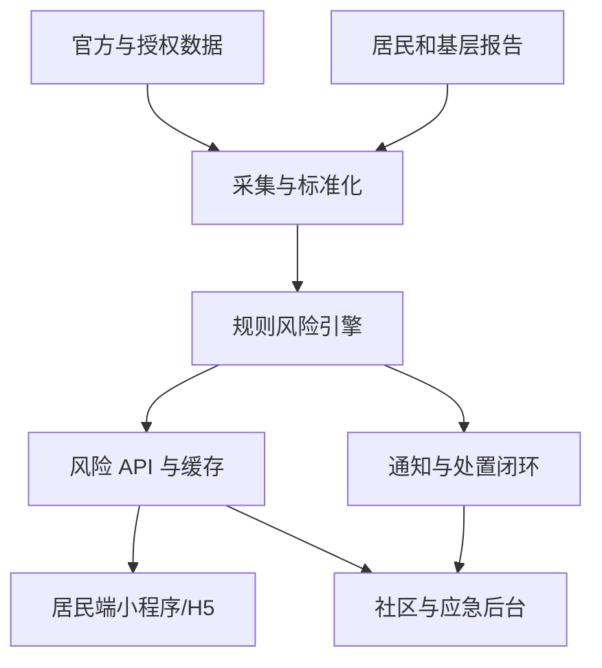

# 汛安：AI 洪涝预警与避险平台

产品与技术规格说明书（SPEC）

版本：0.1

日期：2026-07-14

状态：可进入原型和试点开发

## 1. 产品定义

### 1.1 一句话定位

汛安把官方气象与应急信息、局地雨情、积水上报、道路状态和避险场所数据，转化为居民能立即执行的社区级风险提示、证据化路线建议和基层处置闭环。

### 1.2 核心用户价值

平台围绕暴雨期间的三个连续问题设计：

1. **我所在的位置会不会受到影响？**
2. **现在应该做什么、往哪里走？**
3. **社区和基层应急人员是否已经发现、组织和跟踪处置？**

平台的每个风险结论都必须同时展示：数据来源、观测时间、有效期、数据新鲜度和不确定性。用户看到的是可核查的风险证据，不能把模型输出包装成确定事实。

### 1.3 产品边界

汛安定位为公众避险辅助和基层应急协同工具，承担以下工作：

- 聚合和解释官方预警；
- 将预警与局地风险点、积水上报、道路管制和避险场所关联；
- 在数据覆盖范围内提供路线风险排序；
- 为社区物业、居委会和基层应急站提供核验、派单、通知和反馈闭环；
- 使用 AI 进行信息摘要、问答、报告归类和行动清单生成。

平台不承担以下职责：

- 代替气象、水务、应急管理等部门发布法定预警；
- 依据未经核验的模型结果自动下达停课、停工、封路、转移等指令；
- 在没有传感器或可信观测时声称知道某个楼下的精确积水深度；
- 自动代替消防、医疗、公安或政府指挥系统调度救援；
- 以持续后台定位追踪居民行踪。

### 1.4 建议产品名

工作名：**汛安**。英文内部代号：`FloodShield`。

名称、视觉和域名后续可以独立调整，不影响数据模型和 API 设计。

## 2. 目标与成功标准

### 2.1 MVP 目标

在一个区/县范围内完成一条可验证的最小闭环：

```text
官方预警/雨情输入
    -> 局地风险计算
    -> 居民查看附近风险
    -> 居民上报积水或道路受阻
    -> 社区核验
    -> 路线和避险场所更新
    -> 通知、确认、处置记录留痕
```

### 2.2 MVP 成功标准

试点运行至少覆盖一个汛期演练或真实降雨事件，并满足：

- 居民首次打开首页后，10 秒内能看到当前位置附近的风险状态、官方预警、最近更新时间和下一步动作；
- 具有位置权限时，用户可以把当前位置作为临时起点；拒绝位置权限时，仍能通过搜索或选择社区使用平台；
- 居民提交一条积水/道路受阻报告后，报告进入待核验队列，并可在地图上显示为“待核验”，不能直接以事实形式公开；
- 路线结果至少显示一条推荐路线、风险证据、更新时间和未知风险提示；
- 对官方封闭道路或社区核验为不可通行的路段执行硬避让；
- 预警、风险快照、报告状态和通知发送均具备审计记录；
- AI 服务不可用时，官方预警、规则风险、报告和管理后台仍可正常使用；
- 系统不生成无来源的精确积水深度、预计伤亡、确定性逃生承诺或虚构避险点。

### 2.3 后续指标

这些指标用于试点复盘，不能在没有基线时伪造目标值：

- 预警到用户看到本地化行动卡的延迟；
- 居民报告到社区首次核验的时间；
- 报告核验通过率、重复报告率和过期报告比例；
- 推荐路线被用户采纳后的反馈；
- 社区任务确认率、超时率和闭环率；
- 特殊群体对语音播报、大字号和高对比模式的可用性反馈；
- 数据新鲜度、来源覆盖率和风险结论撤回率；
- “平台风险结论有证据”比例，目标为 100%。

## 3. 用户与角色

### 3.1 普通居民

主要任务：

- 查看当前位置或指定社区的风险；
- 读取官方预警和简短行动建议；
- 查看附近避险场所；
- 获取带风险提示的路线建议；
- 上报积水、道路中断、人员被困等现场信息；
- 接收订阅通知和语音播报。

设计要求：

- 首页只保留一个主动作：“查看我附近”；
- 重要信息同时使用文字、图标、颜色和语音；
- 所有颜色标签都附带文字，避免仅凭红黄绿判断；
- 允许在不登录的情况下查看公共风险和提交匿名报告；
- 登录、手机号、精确位置只在必要功能触发时收集。

### 3.2 老年人、残障人士和行动不便者

新增需求：

- 大字号、高对比、低认知负担界面；
- 一键播放“现在发生了什么”和“现在做什么”；
- 语音播报使用短句、时间、来源和动作顺序；
- 避险场所支持无障碍入口、电梯、厕所、床位、陪护等属性；
- 可由家庭成员或社区工作人员代为绑定提醒对象，但必须明确授权并可撤销；
- 避险路线可以标记“少楼梯、可轮椅、可推婴儿车、可步行”等约束。

### 3.3 社区物业/居委会

主要任务：

- 查看辖区风险态势和重点点位；
- 核验居民报告；
- 发布小区或楼栋通知；
- 维护避险场所、物资点、责任人和重点关注对象数量；
- 创建巡查、封控、转移、物资配送任务；
- 记录任务确认和完成情况。

### 3.4 基层应急管理站

主要任务：

- 查看跨社区风险地图和数据质量；
- 关联官方预警、雨情、积水、道路和避险点；
- 设置辖区规则和通知策略；
- 统一查看待核验事件、救援请求和资源状态；
- 追踪基层责任人的“收到—确认—处置—反馈”闭环；
- 导出事件复盘报告。

### 3.5 平台运营与数据管理员

主要任务：

- 配置数据源、API 密钥和采集周期；
- 审核来源可信度和数据质量；
- 管理角色、权限、敏感字段和审计日志；
- 标记数据源故障或停止使用。

## 4. 信息架构

### 4.1 居民端

底部导航建议保持 4 个入口：

1. **首页**：当前位置风险、官方预警、行动建议、快捷上报；
2. **地图**：风险图层、积水点、道路状态、避险场所；
3. **避险**：起点/目的地、路线建议、场所详情、应急清单；
4. **我的**：订阅区域、语音设置、无障碍设置、报告记录和隐私设置。

### 4.2 社区/应急后台

- 态势总览；
- 事件与报告队列；
- 风险地图；
- 避险场所与物资；
- 通知与叫应记录；
- 任务协同；
- 数据源和规则配置；
- 审计与事件复盘。

### 4.3 首页信息层级

首页必须按行动优先排序：

1. 当前区域状态：正常、需关注、高风险、立即避险；
2. 官方预警：发布单位、等级、发布时间、有效期；
3. 下一步动作：减少外出、远离地下空间、前往指定场所等；
4. 附近证据：最近积水报告、道路关闭、雨情观测；
5. 操作入口：路线、避险场所、上报、播放语音。

平台风险颜色和官方预警颜色必须分开标识，避免用户将两者混为同一种权威等级。

## 5. 核心功能规格

### 5.1 附近风险摘要

用户打开首页后，系统返回一个带时间和来源的 `NearbyRiskSummary`：

```json
{
  "areaId": "area_demo_001",
  "areaName": "示例街道",
  "platformRiskBand": "high",
  "platformRiskLabel": "高风险，减少外出",
  "officialAlerts": [],
  "evidence": [],
  "recommendedActions": [],
  "dataStatus": "partial",
  "observedAt": "2026-07-14T18:30:00+08:00",
  "expiresAt": "2026-07-14T19:00:00+08:00",
  "confidence": 0.72,
  "disclaimer": "平台信息仅作避险参考，请以当地政府和专业部门最新指令为准。"
}
```

强制字段：

- `observedAt`：数据观测或计算时间；
- `expiresAt`：超过时间后前端显著显示“数据可能已过期”；
- `sources` 或 `evidence`：可追溯来源；
- `dataStatus`：`fresh`、`partial`、`stale`、`unknown`；
- `confidence`：数据支撑程度，不表示灾害发生概率；
- `disclaimer`：在高风险页面保留。

### 5.2 官方预警聚合

每条官方预警必须保存原文和规范化字段：

- 来源单位与来源链接；
- 原始事件 ID；
- 灾种：暴雨、洪水、台风、山洪、地质灾害等；
- 官方等级和颜色；
- 影响区域几何范围；
- 发布时间、更新时间、失效时间和撤销状态；
- 原文、行动指南和语言版本；
- 采集时间与数据源状态。

规则：

- 官方预警只做事实展示和触发通知策略的输入；
- 不能根据平台风险分数改写官方等级；
- 同一事件按 `source + sourceEventId` 去重；
- 预警撤销、更新和过期都要产生审计事件；
- 若本地气象部门使用地方标准，平台以属地气象部门解释为准，不能硬编码全国统一阈值。

### 5.3 局地风险地图

图层分为三类：

**官方图层**

- 官方预警影响范围；
- 官方发布的洪水、山洪、地质灾害风险区；
- 政府或交通部门发布的道路管制。

**平台计算图层**

- 局地风险网格；
- 风险变化趋势；
- 数据覆盖与过期区域；
- 路线风险段。

**公众与基层观测图层**

- 积水报告；
- 道路受阻；
- 井盖、树木、地下空间等隐患；
- 社区核验记录；
- 救援请求。

公众可见报告必须模糊化精确位置，默认显示到路段或约 100 米范围；后台按照权限查看精确位置。图片和文字需要经过敏感信息检测与人工/规则审核。

### 5.4 积水与道路事件上报

居民上报最少步骤：

1. 选择事件类型；
2. 选择粗粒度状态；
3. 选择当前位置或地图点；
4. 可选上传照片、文字或语音；
5. 提交并显示“待核验”。

事件类型：

- 积水；
- 道路无法通行；
- 地下空间进水；
- 井盖/路面破损；
- 人员或车辆受困；
- 其他隐患。

水情状态建议采用可理解的粗粒度枚举：

- `surface_wet`：路面湿滑或有少量积水；
- `ankle_or_less`：约脚踝及以下；
- `knee_or_less`：约膝部及以下；
- `vehicle_impassable`：车辆无法安全通行；
- `unknown`：无法判断。

这些是用户观察标签，不能被系统解释为测量值。显示时使用“用户估计/现场观察”，禁止生成精确厘米数。

报告状态机：

```text
submitted -> pending_review -> verified -> active -> expired
                       \-> rejected
```

如果报告包含“人员受困”或“地下空间进水”等高危关键词，进入高优先级队列并提示用户使用当地紧急求助渠道。系统可以生成通知任务，不能宣称救援已经派出。

### 5.5 避险场所

避险场所必须由可信管理方创建或核验，字段包括：

- 名称、地址、坐标和服务半径；
- 当前状态：未知、开放、即将开放、容量紧张、满员、关闭；
- 最大容量、当前估计人数和更新时间；
- 开放时间和联系人；
- 是否需要登记；
- 无障碍入口、卫生间、电源、饮水、医疗支持；
- 宠物、婴幼儿、老年人等接收条件；
- 现场照片或官方说明；
- 数据来源、核验人和核验时间。

前端使用“已核验/待确认/状态未知”标签。状态未知的场所不能被描述成当前安全可用。

### 5.6 证据化避险路线

路线功能分为两个阶段：

**MVP：地图供应商路线 + 风险重排**

1. 调用地图供应商获取 2—3 条候选路线；
2. 对路线进行采样，匹配官方封路、核验积水点、平台风险网格和数据过期状态；
3. 对高风险或明确不可通行路段设置硬约束；
4. 对未知风险增加不确定性惩罚；
5. 返回“推荐”“备选”“风险未知”及证据。

**后续：自有路网图搜索**

在拥有稳定道路事件和传感器数据后，再建立带时间权重的路网搜索。

路线评分示例：

```text
routeCost = travelTime
          + verifiedHazardPenalty
          + officialClosurePenalty
          + staleOrUnknownPenalty
```

其中：

- 官方封闭或已核验不可通行：硬阻断；
- 高风险但可通行：高惩罚并展示原因；
- 风险未知：不标记为安全，展示数据缺口；
- 路线结果必须包含计算时间、数据更新时间和“以现场标志及官方指令为准”的提示。

产品文案使用“风险证据较少/较多”“推荐查看”表达，不使用“绝对安全”“保证逃生”等承诺。

### 5.7 语音播报与无障碍

播报内容优先采用模板化短句：

```text
现在是 19 点 20 分。
你所在的示例街道有暴雨黄色预警，来源是示例气象台。
建议减少外出，远离地下通道和低洼处。
这条信息更新时间为 19 点 15 分。
```

要求：

- 支持点击播放，不默认持续监听麦克风；
- 语音文本显示在页面上；
- 播报中加入来源和时间；
- AI 生成内容先转换为结构化行动卡，再由模板播报；
- 没有网络时播放最近一次缓存信息，并明确标记缓存时间；
- 不用颜色作为唯一状态信息；
- 支持字号、对比度、减少动画、读屏语义和键盘操作。

### 5.8 通知与“叫应”闭环

通知策略分层：

- 居民订阅：小程序订阅消息、App 推送或短信等渠道由运营地区配置；
- 社区通知：小区、楼栋或辖区范围内的行动提示；
- 责任人叫应：通知、电话或人工联络结果记录在系统中；
- 高危事件：创建待确认任务，要求责任人反馈收到、已处置或无法处置。

状态必须可审计：

```text
created -> queued -> sent -> delivered -> acknowledged -> handled
                              \-> failed -> retrying
```

平台应支持多次重试、人工补联和超时升级。网络推送成功不能等价于责任人已经看到，更不能等价于现场已经安全。

### 5.9 AI 助手

AI 的安全定位是“解释和辅助”，核心风险计算保持可解释、可测试、可回放。

允许 AI 做：

- 将官方预警原文转换为短行动清单；
- 汇总某个社区最近的报告和处置记录；
- 对报告进行事件分类、去重建议和优先级建议；
- 根据已核验数据回答“附近发生了什么”；
- 为基层人员生成值班交接或事件复盘草稿；
- 把结构化行动卡转换成语音播报文本。

禁止 AI 做：

- 单独决定官方预警等级；
- 直接发布未经人工确认的高危事件；
- 生成没有来源的避险地点、道路状态或积水深度；
- 自动确认救援已经派出；
- 接受用户报告中的指令作为系统权限；
- 将精确位置、家庭成员信息、健康信息默认发送给模型服务。

AI 输出统一采用结构化格式：

```json
{
  "summary": "...",
  "actions": ["..."],
  "evidence": [
    {"sourceId": "alert_001", "observedAt": "...", "type": "official_alert"}
  ],
  "uncertainty": "...",
  "needsHumanReview": true,
  "generatedAt": "...",
  "expiresAt": "..."
}
```

当证据为空、已过期或相互冲突时，AI 必须降低结论强度并明确说明未知信息。

## 6. 风险计算设计

### 6.1 基本原则

风险计算服务生成的是平台内部风险状态，不构成官方灾害预报。输入数据分为：

- 官方预警；
- 短时降雨和累计降雨；
- 水位、积水或泵站传感器；
- 历史易涝点和地形/排水基础数据；
- 已核验的公众/基层报告；
- 道路封闭、交通管制和避险场所状态。

### 6.2 MVP 计算模型

使用可解释的规则和归一化分数：

```text
riskScore = clamp(
    w_alert * alertFactor
  + w_rain * rainfallFactor
  + w_observation * observationFactor
  + w_static * staticHazardFactor
  + w_road * roadFactor,
  0,
  100
)
```

初始权重只作为试点配置，不代表通用科学结论。每次计算保存：

- 输入快照；
- 规则版本；
- 权重和阈值；
- 计算时间；
- 输出风险带；
- 数据覆盖率；
- 冲突和缺失说明。

平台风险带建议：

| 风险带 | 解释 | 默认动作 |
| --- | --- | --- |
| `normal` | 当前可用证据未显示明显异常 | 关注官方更新 |
| `attention` | 存在降雨、预警或局地风险信号 | 减少不必要外出 |
| `high` | 多类证据指向局地受影响 | 避开低洼、地下和涉水路段 |
| `critical` | 官方指令、核验事件或多类强证据叠加 | 按属地指令转移或就近避险 |

风险带阈值、动作文本和通知范围必须由试点管理员配置，并保留版本。平台风险带不能冒充官方蓝、黄、橙、红预警。

### 6.3 可信度和数据新鲜度

`confidence` 仅表示当前证据的覆盖和一致程度，可由以下因素组成：

- 来源可信等级；
- 数据距离当前时间的衰减；
- 空间覆盖程度；
- 多源数据是否一致；
- 报告是否已经核验；
- 传感器是否在线。

示例状态：

- `fresh`：主要输入在有效期内；
- `partial`：部分输入缺失或空间覆盖不足；
- `stale`：关键数据超过有效期；
- `unknown`：没有足够证据计算。

缺失数据必须表现为“未知”，不能默认为安全。

## 7. 数据源策略

### 7.1 数据源分层

**第一层：官方和授权数据**

- 属地气象部门预警和预报；
- 水务、应急、住建、交通等部门的公开或授权数据；
- 政府核验的避险场所、道路管制和物资点；
- 合法授权的传感器数据。

**第二层：平台计算数据**

- 统一空间网格风险；
- 经过版本控制的风险规则；
- 路线风险重排结果；
- 数据覆盖和新鲜度。

**第三层：公众观测**

- 现场照片、文字、语音；
- 位置和时间；
- 用户信任等级、重复性和社区核验结果。

每个数据源都要配置：`sourceId`、名称、授权状态、空间范围、刷新周期、字段映射、可信等级、故障状态和责任人。

### 7.2 适配器接口

外部数据必须通过适配器接入，业务层不能直接依赖某一家供应商：

```ts
interface WeatherWarningProvider {
  fetchWarnings(area: GeoJSON.Polygon): Promise<RawWarning[]>;
}

interface RainfallProvider {
  fetchRainfall(area: GeoJSON.Polygon, windowMinutes: number): Promise<RainfallObservation[]>;
}

interface MapProvider {
  geocode(query: string): Promise<Place[]>;
  route(input: RouteRequest): Promise<RouteCandidate[]>;
}
```

MVP 先使用 `mock` 适配器完成开发和测试，真实供应商接入必须经过授权、限流、失败重试和来源审计。

### 7.3 数据故障策略

- 外部源超时：保留最近一次数据并标记过期；
- 字段缺失：拒绝写入风险计算，进入数据质量队列；
- 地理范围异常：拒绝并记录；
- 时间戳倒退：拒绝覆盖新数据；
- 多源冲突：保留所有原始值，显示冲突，不静默平均；
- AI 服务故障：回退到规则引擎和模板文案；
- 地图服务故障：显示已缓存路线或提示无法规划，禁止虚构路线。

## 8. 系统架构

### 8.1 推荐 MVP 架构



推荐技术组合：

- 居民端：Taro + React + TypeScript，优先支持微信小程序和 H5；
- 管理后台：Next.js + TypeScript；
- 后端：FastAPI + Python，使用 OpenAPI 生成接口文档；
- 数据库：PostgreSQL + PostGIS；
- 缓存：Redis，可在 MVP 后半段加入；
- 异步任务：开发期使用定时任务，事件规模上升后切换到队列；
- 文件：对象存储适配器，开发期使用本地存储；
- 认证：JWT/OAuth2 或试点单位现有身份系统；
- 部署：Docker Compose 开发环境，生产环境按试点单位要求部署。

原生 App 暂不作为第一阶段交付物。API、鉴权、推送和设计系统保持跨端约束，后续可接入 React Native/原生客户端。

### 8.2 服务边界

建议先保持模块化单体，避免过早拆分微服务：

- `auth`：用户、组织、角色、权限；
- `geo`：区域、点位、路段和空间查询；
- `alerts`：官方预警；
- `observations`：雨情、传感器和公众报告；
- `risk`：规则计算、快照、可信度；
- `routes`：地图供应商候选路线和风险重排；
- `shelters`：场所和容量状态；
- `notifications`：消息、重试、确认和升级；
- `ai`：摘要、问答、分类和人工审核；
- `audit`：不可变审计事件。

拆分服务的条件：独立扩缩容需求、明确的故障隔离需求或试点规模数据证明单体已成为瓶颈。

## 9. 数据模型

以下为 MVP 核心表，字段可按实际数据库实现调整。

### 9.1 组织与权限

`users`

- `id`
- `display_name`
- `phone_hash`；如确需通知，单独保存加密手机号
- `role`
- `organization_id`
- `accessibility_preferences`
- `location_consent_at`
- `created_at`
- `disabled_at`

`organizations`

- `id`
- `name`
- `type`: `community`, `property`, `emergency_station`, `operator`
- `geometry`
- `status`

`audit_logs`

- `id`
- `actor_id`
- `action`
- `resource_type`
- `resource_id`
- `before_json`
- `after_json`
- `created_at`
- `request_id`

### 9.2 风险与事件

`official_alerts`

- `id`
- `source_id`
- `source_event_id`
- `hazard_type`
- `official_level`
- `official_color`
- `geometry`
- `issued_at`
- `updated_at`
- `expires_at`
- `revoked_at`
- `raw_payload`
- `source_url`

`observations`

- `id`
- `source_id`
- `type`
- `geometry`
- `value_json`
- `observed_at`
- `expires_at`
- `verification_status`
- `created_by`

`risk_snapshots`

- `id`
- `area_id`
- `risk_band`
- `risk_score`
- `confidence`
- `data_status`
- `evidence_json`
- `rule_version`
- `input_snapshot_json`
- `calculated_at`
- `expires_at`

`hazard_reports`

- `id`
- `reporter_id` nullable
- `event_type`
- `state`
- `rough_location`
- `exact_location_encrypted` nullable
- `observation_json`
- `media_refs`
- `priority`
- `submitted_at`
- `verified_at`
- `expires_at`
- `verified_by`

### 9.3 路线与场所

`road_events`

- `id`
- `road_segment_ref`
- `event_type`
- `severity`
- `state`
- `source_id`
- `geometry`
- `valid_from`
- `valid_until`
- `verified_by`

`shelters`

- `id`
- `name`
- `address`
- `geometry`
- `status`
- `capacity_total`
- `capacity_estimated`
- `accessibility_json`
- `contact_json`
- `source_id`
- `verified_at`
- `expires_at`

`route_requests`

- `id`
- `user_id` nullable
- `origin_geometry` encrypted or short-lived
- `destination_geometry`
- `constraints_json`
- `created_at`
- `expires_at`

`route_results`

- `id`
- `request_id`
- `provider`
- `route_geometry`
- `travel_time_seconds`
- `risk_cost`
- `route_label`
- `evidence_json`
- `data_status`
- `calculated_at`
- `expires_at`

## 10. API 规格

接口统一返回 `requestId`、`dataStatus`、时间戳和来源字段。错误响应不泄露内部堆栈。

### 10.1 居民端接口

```text
GET  /v1/areas/resolve?lat=&lng=
GET  /v1/nearby/summary?areaId=&lat=&lng=
GET  /v1/alerts?areaId=&active=true
GET  /v1/map/layers?areaId=&types=
GET  /v1/shelters/nearby?lat=&lng=&accessibility=
POST /v1/hazard-reports
GET  /v1/hazard-reports/{id}
POST /v1/routes/evacuation
GET  /v1/routes/{id}
POST /v1/notifications/subscriptions
POST /v1/voice/announcement
```

### 10.2 后台接口

```text
GET   /v1/admin/risk/overview
GET   /v1/admin/reports?state=pending_review
POST  /v1/admin/reports/{id}/verify
POST  /v1/admin/reports/{id}/reject
POST  /v1/admin/road-events
PATCH /v1/admin/shelters/{id}
POST  /v1/admin/tasks
PATCH /v1/admin/tasks/{id}
POST  /v1/admin/notifications/dispatch
GET   /v1/admin/notification-deliveries/{id}
GET   /v1/admin/audit-logs
```

### 10.3 内部采集接口

```text
POST /internal/ingestion/{sourceId}/warnings
POST /internal/ingestion/{sourceId}/rainfall
POST /internal/ingestion/{sourceId}/road-events
POST /internal/risk/recompute
GET  /internal/data-quality/issues
```

内部接口需要服务间认证、签名或网络隔离，不能暴露给居民端。

## 11. 安全、隐私和合规要求

### 11.1 位置数据

- 前台定位采用一次性定位优先；
- 用户主动打开路线功能时再申请定位；
- 默认不做后台持续定位；
- 公众报告的公开位置做空间模糊；
- 精确位置只在核验、救援协同等明确目的下短期保存；
- 位置数据设定自动过期和删除策略；
- 位置权限拒绝后，核心公共功能继续可用；
- 在隐私说明中明确收集目的、范围、保存时间和撤回方式。

### 11.2 权限

采用最小权限：

- 居民：读取公共风险、创建自己的报告、管理自己的订阅；
- 社区：查看辖区事件、核验报告、维护本辖区资源；
- 应急站：查看授权区域、配置规则和跨社区任务；
- 管理员：管理数据源、角色和审计；
- 所有高风险操作要求二次确认和审计。

### 11.3 内容和模型安全

- 用户文本、图片 OCR 和语音转写都视为不可信输入；
- 任何用户内容不能改变系统角色、权限、规则或预警等级；
- AI 只接收任务所需的最小字段；
- 模型输出需经过 JSON schema 校验、来源校验和政策过滤；
- 公共高风险文案默认人工确认；
- 保存模型版本、提示词版本、输入来源 ID 和输出审核状态。

### 11.4 可靠性与降级

- 关键页面展示最近一次有效数据和准确时间；
- 风险引擎失败时显示“暂无法计算”，不显示绿色安全状态；
- 推送服务失败时进入重试和人工补联队列；
- 地图失败时提供避险场所地址、电话和官方信息入口；
- 服务恢复后补算风险并记录数据缺口；
- 高峰期间采用只读缓存，确保附近风险页面优先可用。

## 12. 观测、审计和运营

必须记录：

- 数据源拉取成功率、延迟、字段错误和覆盖范围；
- 风险计算输入、规则版本和输出；
- 官方预警的新增、更新、撤销和过期；
- 报告提交、核验、拒绝、过期和合并；
- 通知发送、送达、确认、重试和升级；
- 管理员修改场所、道路、规则和权限的行为；
- AI 生成和人工审核记录。

每个事件使用 `requestId` 和 `correlationId` 贯穿采集、计算、通知和处置。事件数据应支持导出，用于事后复盘和责任核查。

## 13. 版本范围

### V0：可演示原型

- 使用 mock 预警、雨情、报告和路线数据；
- 居民端首页、地图、上报、避险场所、路线页面；
- 后台报告核验和场所维护；
- 风险带规则计算；
- 语音模板播报；
- 自动化测试和演示种子数据。

### V1：单区试点

- 接入经授权的官方预警和至少一个局地观测源；
- 建立重点易涝点和避险场所台账；
- 上线报告核验、道路事件和通知确认；
- 支持微信小程序和后台 Web；
- 完成一次桌面推演或实地演练；
- 形成数据质量、误报、漏报和路线风险复盘报告。

### V2：增强版

- 接入更多传感器、泵站、河道或交通数据；
- 训练本地历史数据模型，并和规则引擎并行对照；
- 支持社区任务、物资和重点场所调度；
- 接入原生 App 推送；
- 建立多区复制和数据隔离能力。

### 明确暂缓

- 无传感器条件下的街道级精确积水深度预测；
- 自动向公众发布未经核验的 AI 灾害结论；
- 自动控制泵站、闸门、交通信号或救援设备；
- 自动拨打救援电话并代表用户陈述现场事实；
- 以家庭成员健康、行动能力等敏感信息建立公开风险画像。

## 14. 验收用例

### 用例 A：官方预警到居民行动卡

给定一个正在生效的官方暴雨预警，系统应：

- 正确显示来源单位、等级、发布时间和有效期；
- 计算影响区域内社区的风险摘要；
- 生成可追溯的行动卡；
- 在预警过期或撤销时更新状态；
- AI 不可用时仍然展示模板行动卡。

### 用例 B：居民提交积水报告

给定位置权限开启或关闭两种情况，系统应：

- 都允许用户完成报告；
- 位置开启时使用一次性位置；
- 位置关闭时允许手动选点；
- 报告先显示待核验；
- 后台核验后才升级为可信证据；
- 报告过期后从推荐路线硬约束中移除，并保留历史记录。

### 用例 C：路线避开危险路段

给定候选路线穿过官方封路段，系统应：

- 将该路线标记为不可用或显著降级；
- 返回其他候选路线或明确提示暂无可验证路线；
- 展示封路来源和更新时间；
- 不把另一条数据未知的路线称作安全。

### 用例 D：老年人语音播报

给定老年模式开启，系统应：

- 首页可见播放按钮；
- 语音包含区域、事件、行动、来源和时间；
- 文字与语音内容一致；
- 无网络时读出缓存时间并提示信息可能过期；
- 不申请无关麦克风或后台定位权限。

### 用例 E：通知闭环

给定一个社区高优先级事件，系统应：

- 创建通知和处置任务；
- 记录发送、失败、重试和确认；
- 超时后升级给上级角色；
- 任务关闭前要求填写处置结果；
- 任何人不能直接删除审计记录。

## 15. 第一阶段实施顺序

推荐按以下顺序开发：

1. 先完成 mock 数据、数据模型、风险快照和居民首页；
2. 再完成报告上报、后台核验和地图图层；
3. 再完成路线候选与风险重排；
4. 再接入真实数据源和通知渠道；
5. 最后加入 AI 摘要、问答和复盘功能；
6. 通过演练和对抗性测试后，再进入试点。

选择这个顺序的原因是：风险页面、数据时效、报告核验和路线约束是生命安全闭环的基础，AI 生成能力应建立在可回放的结构化证据之上。

## 16. 参考依据与数据治理提醒

以下资料用于产品边界和治理设计，接入具体城市时仍需取得属地部门、数据供应商和地图服务商的正式授权与最新接口文档：

1. [应急管理部：强化气象预警与应急响应联动，建立直达基层责任人的“叫应”机制](https://www.mem.gov.cn/xw/yjglbgzdt/202206/t20220620_416162.shtml)
2. [应急管理部：2026 年汛期防范应对部署，强调“叫应”和转移避险闭环](https://www.mem.gov.cn/xw/yjglbgzdt/202606/t20260622_608618.shtml)
3. [中国天气网：暴雨预警信号四级及防御指南](https://news.weather.com.cn/2016/06/2528715.shtml)
4. [北京市怀柔区政府：地方气象部门按属地特点发布预警标准的说明](https://www.bjhr.gov.cn/zt/2025aqdx/aqzskp/202506/t20250630_4136636.html)
5. [中国网信网：中华人民共和国个人信息保护法](https://www.cac.gov.cn/2021-08/20/c_1631050028355286.htm)
6. [中国网信网：2026 年互联网应用程序个人信息收集使用规定（征求意见稿）](https://www.cac.gov.cn/2026-01/10/c_1769603446094128.htm)

第 6 项目前属于公开征求意见稿。它可作为权限最小化和位置调用设计的参考，正式上线前仍需由专业人员根据届时有效的法律法规、部门规章和平台规则完成合规审查。

产品上线前需要逐项核查：气象和水务数据授权、地图与路径数据授权、个人信息处理规则、未成年人和特殊群体信息处理、短信/推送资质、应急通知责任边界、内容审核和灾害事件复盘机制。
