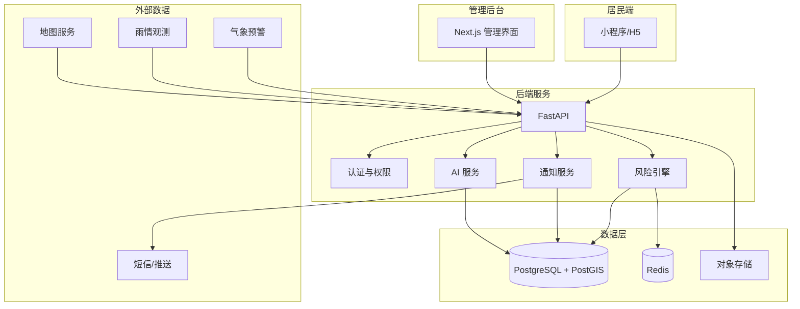
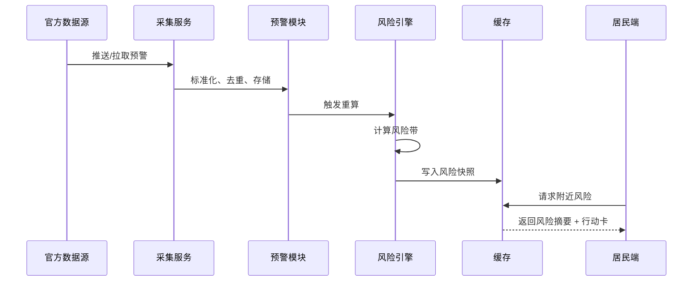
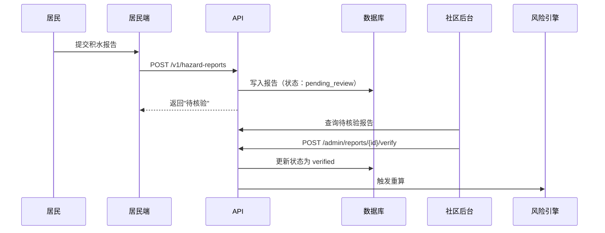
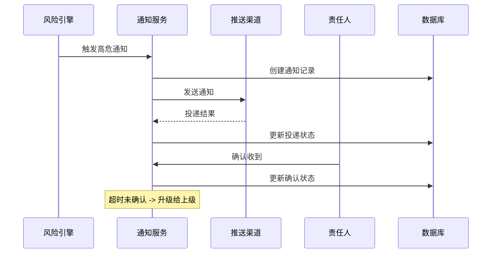

# 架构文档

## 1. 系统概览

汛安采用模块化单体架构，以 FastAPI + Python 为核心后端，Taro + React 为居民端，Next.js + TypeScript 为管理后台。系统围绕"预警输入 -> 风险计算 -> 居民避险 -> 基层处置"闭环设计。

### 技术栈

| 层级 | 技术选型 | 说明 |
|------|----------|------|
| 居民端 | Taro + React + TypeScript | 微信小程序 + H5 |
| 管理后台 | Next.js + TypeScript | SSR + 管理界面 |
| 后端 | FastAPI + Python 3.11+ | 异步 API，OpenAPI 自动生成 |
| 数据库 | PostgreSQL + PostGIS | 空间查询支持 |
| 缓存 | Redis | 风险快照、会话、限流 |
| 异步任务 | Celery / 定时任务 | 通知重试、数据采集 |
| 文件存储 | 对象存储适配器 | 开发期本地存储 |
| 部署 | Docker Compose | 本地开发环境 |

### 架构图



## 2. 模块边界

系统采用模块化单体架构，各模块职责清晰、接口明确。拆分服务的条件：独立扩缩容需求、明确的故障隔离需求或试点规模数据证明单体已成为瓶颈。

### 2.1 auth — 认证与权限

**职责**：用户管理、组织管理、角色权限、JWT 签发

**核心实体**：
- `users` — 用户账号、手机号哈希、无障碍偏好
- `organizations` — 社区、物业、应急站、运营方
- `roles` — 居民、社区工作者、应急管理员、系统管理员

**接口**：
- `POST /v1/auth/login` — 登录获取 JWT
- `POST /v1/auth/refresh` — 刷新令牌
- `GET /v1/auth/me` — 当前用户信息
- `PATCH /v1/auth/preferences` — 更新偏好设置

**权限模型**：
- 居民：读取公共风险、创建自己的报告、管理自己的订阅
- 社区：查看辖区事件、核验报告、维护本辖区资源
- 应急站：查看授权区域、配置规则和跨社区任务
- 管理员：管理数据源、角色和审计

### 2.2 geo — 空间查询

**职责**：区域管理、点位查询、空间索引、坐标转换

**核心实体**：
- `areas` — 行政区划、社区边界
- `road_segments` — 路段几何
- `spatial_index` — PostGIS 空间索引

**接口**：
- `GET /v1/areas/resolve?lat=&lng=` — 坐标转区域
- `GET /v1/areas/{id}/geometry` — 获取区域几何
- `GET /v1/geo/nearby?lat=&lng=&radius=&type=` — 附近点位查询

### 2.3 alerts — 官方预警

**职责**：预警采集、去重、存储、生命周期管理

**核心实体**：
- `official_alerts` — 预警记录（来源、灾种、等级、几何、时间）

**规则**：
- 同一事件按 `source + sourceEventId` 去重
- 预警撤销、更新和过期都产生审计事件
- 官方预警只做事实展示，不能根据平台风险分数改写官方等级
- 若本地气象部门使用地方标准，以属地气象部门解释为准

**接口**：
- `GET /v1/alerts?areaId=&active=true` — 查询生效预警
- `GET /v1/alerts/{id}` — 预警详情
- `POST /internal/ingestion/{sourceId}/warnings` — 内部采集接口

### 2.4 observations — 雨情、传感器与公众报告

**职责**：多源观测数据采集、公众报告管理、核验流程

**核心实体**：
- `observations` — 雨情、水位、传感器数据
- `hazard_reports` — 公众积水/道路报告

**报告状态机**：
```
submitted -> pending_review -> verified -> active -> expired
                       \-> rejected
```

**水情状态枚举**（用户观察标签，非测量值）：
- `surface_wet` — 路面湿滑或有少量积水
- `ankle_or_less` — 约脚踝及以下
- `knee_or_less` — 约膝部及以下
- `vehicle_impassable` — 车辆无法安全通行
- `unknown` — 无法判断

**接口**：
- `POST /v1/hazard-reports` — 提交报告
- `GET /v1/hazard-reports/{id}` — 查询报告
- `POST /v1/admin/reports/{id}/verify` — 核验报告
- `POST /v1/admin/reports/{id}/reject` — 拒绝报告

### 2.5 risk — 风险计算

**职责**：规则引擎、风险快照、可信度计算、数据新鲜度

**核心实体**：
- `risk_snapshots` — 风险快照（区域、风险带、分数、证据、规则版本）

**风险带定义**：

| 风险带 | 解释 | 默认动作 |
|--------|------|----------|
| `normal` | 当前可用证据未显示明显异常 | 关注官方更新 |
| `attention` | 存在降雨、预警或局地风险信号 | 减少不必要外出 |
| `high` | 多类证据指向局地受影响 | 避开低洼、地下和涉水路段 |
| `critical` | 官方指令、核验事件或多类强证据叠加 | 按属地指令转移或就近避险 |

**计算公式**（MVP 规则引擎）：
```
riskScore = clamp(
    w_alert * alertFactor
  + w_rain * rainfallFactor
  + w_observation * observationFactor
  + w_static * staticHazardFactor
  + w_road * roadFactor,
  0, 100
)
```

**每次计算保存**：输入快照、规则版本、权重和阈值、计算时间、输出风险带、数据覆盖率、冲突和缺失说明。

**接口**：
- `GET /v1/nearby/summary?areaId=` — 附近风险摘要
- `GET /v1/admin/risk/overview` — 后台风险总览
- `POST /internal/risk/recompute` — 触发重算

### 2.6 routes — 路线规划

**职责**：候选路线获取、风险重排、证据绑定

**核心实体**：
- `route_requests` — 路线请求（起点、终点、约束）
- `route_results` — 路线结果（几何、耗时、风险成本、证据）

**路线评分**：
```
routeCost = travelTime
          + verifiedHazardPenalty
          + officialClosurePenalty
          + staleOrUnknownPenalty
```

**规则**：
- 官方封闭或已核验不可通行：硬阻断
- 高风险但可通行：高惩罚并展示原因
- 风险未知：不标记为安全，展示数据缺口
- 路线结果必须包含计算时间、数据更新时间和"以现场标志及官方指令为准"的提示

**接口**：
- `POST /v1/routes/evacuation` — 请求避险路线
- `GET /v1/routes/{id}` — 获取路线结果

### 2.7 shelters — 避险场所

**职责**：场所管理、容量状态、无障碍属性

**核心实体**：
- `shelters` — 避险场所（名称、地址、坐标、状态、容量、无障碍属性）

**场所状态**：未知、开放、即将开放、容量紧张、满员、关闭

**前端标签**：已核验 / 待确认 / 状态未知（状态未知不能描述为当前安全可用）

**接口**：
- `GET /v1/shelters/nearby?lat=&lng=&accessibility=` — 附近场所
- `GET /v1/shelters/{id}` — 场所详情
- `PATCH /v1/admin/shelters/{id}` — 更新场所

### 2.8 notifications — 通知闭环

**职责**：消息发送、重试、确认、升级

**核心实体**：
- `notifications` — 通知记录
- `notification_deliveries` — 投递状态
- `tasks` — 处置任务

**通知状态机**：
```
created -> queued -> sent -> delivered -> acknowledged -> handled
                              \-> failed -> retrying
```

**规则**：
- 支持多次重试、人工补联和超时升级
- 网络推送成功不等于责任人已看到，更不等于现场已安全
- 高危事件创建待确认任务，要求责任人反馈

**接口**：
- `POST /v1/notifications/subscriptions` — 订阅通知
- `POST /v1/admin/notifications/dispatch` — 发送通知
- `GET /v1/admin/notification-deliveries/{id}` — 查询投递状态

### 2.9 ai — AI 辅助

**职责**：信息摘要、问答、分类、人工审核

**允许 AI 做**：
- 将官方预警原文转换为短行动清单
- 汇总社区最近的报告和处置记录
- 对报告进行事件分类、去重建议和优先级建议
- 根据已核验数据回答"附近发生了什么"
- 为基层人员生成值班交接或事件复盘草稿
- 把结构化行动卡转换成语音播报文本

**禁止 AI 做**：
- 单独决定官方预警等级
- 直接发布未经人工确认的高危事件
- 生成没有来源的避险地点、道路状态或积水深度
- 自动确认救援已经派出
- 接受用户报告中的指令作为系统权限
- 将精确位置、家庭成员信息、健康信息默认发送给模型服务

**输出格式**：
```json
{
  "summary": "...",
  "actions": ["..."],
  "evidence": [
    {"sourceId": "alert_001", "observedAt": "...", "type": "official_alert"}
  ],
  "uncertainty": "...",
  "needsHumanReview": true,
  "generatedAt": "...",
  "expiresAt": "..."
}
```

**接口**：
- `POST /v1/ai/summarize` — 生成摘要
- `POST /v1/ai/classify` — 报告分类
- `POST /v1/voice/announcement` — 生成语音播报

### 2.10 audit — 审计日志

**职责**：不可变审计事件、操作追溯

**核心实体**：
- `audit_logs` — 审计记录（操作者、动作、资源、变更前后、时间、请求 ID）

**必须记录**：
- 数据源拉取成功率、延迟、字段错误和覆盖范围
- 风险计算输入、规则版本和输出
- 官方预警的新增、更新、撤销和过期
- 报告提交、核验、拒绝、过期和合并
- 通知发送、送达、确认、重试和升级
- 管理员修改场所、道路、规则和权限的行为
- AI 生成和人工审核记录

**接口**：
- `GET /v1/admin/audit-logs` — 查询审计日志

## 3. 数据流

### 3.1 预警到行动卡流程



### 3.2 居民报告到核验流程



### 3.3 通知闭环流程



## 4. 降级策略

系统在各组件故障时的行为设计，确保不显示虚假安全状态。

### 4.1 AI 服务故障

**症状**：AI API 超时、返回错误、模型不可用

**降级行为**：
- 行动卡回退到模板文案（基于预警等级和风险带的预设模板）
- 语音播报使用模板化短句
- 报告分类回退到关键词匹配规则
- 前端显示"AI 辅助暂不可用，以下为规则引擎结果"

**不做的事**：
- 不停止风险计算
- 不停止预警展示
- 不显示"系统正常"

### 4.2 气象/外部数据故障

**症状**：数据源超时、返回异常、字段缺失

**降级行为**：
- 保留最近一次有效数据，标记 `dataStatus: stale`
- 风险计算使用可用数据，降低 `confidence`
- 前端显著显示"数据可能已过期"和最后更新时间
- 数据质量队列记录故障

**不做的事**：
- 不用过期数据假装为新鲜数据
- 不在缺失数据时默认为安全
- 不静默丢弃异常数据

### 4.3 地图服务故障

**症状**：路线规划 API 超时、地理编码失败

**降级行为**：
- 显示已缓存的最近路线（标记缓存时间）
- 提供避险场所地址、电话和官方信息入口
- 提示"路线规划暂不可用，请参考以下避险场所"
- 地图图层降级为已缓存数据

**不做的事**：
- 不虚构路线
- 不隐藏路线不可用的事实

### 4.4 数据库只读

**症状**：数据库主库不可写、连接池耗尽

**降级行为**：
- 风险查询从缓存或只读副本读取
- 报告提交进入队列，数据库恢复后写入
- 通知记录缓存在 Redis，恢复后批量写入
- 前端提示"报告提交中，稍后同步"

**不做的事**：
- 不丢失用户提交的报告
- 不中断风险查询

### 4.5 无网络

**症状**：用户设备离线

**降级行为**：
- 播放最近一次缓存的语音信息，明确标记缓存时间
- 显示最近一次缓存的风险状态和时间
- 提示"以下信息更新于 XX:XX，可能已过期"
- 报告暂存在本地，恢复网络后上传

**不做的事**：
- 不隐藏数据过期事实
- 不使用无网络时的过期数据做决策

## 5. 安全边界

### 5.1 认证与授权

- JWT 签发与验证
- 角色权限最小化
- 高风险操作二次确认
- 敏感字段加密存储

### 5.2 输入验证

- 所有 API 输入校验（Pydantic 模型）
- 空间数据有效性检查
- 时间戳合理性检查
- 用户文本内容过滤

### 5.3 数据隔离

- 组织级数据隔离（社区只能看辖区）
- 精确位置加密存储
- 公开 API 位置模糊化
- 审计日志不可删除

### 5.4 外部调用

- 所有外部调用通过适配器
- 超时、重试、熔断
- 来源审计日志
- mock 默认开启

## 6. Provider 适配器模式

外部数据必须通过适配器接入，业务层不直接依赖任何供应商。

### 6.1 接口定义

```typescript
interface WeatherWarningProvider {
  fetchWarnings(area: GeoJSON.Polygon): Promise<RawWarning[]>;
}

interface RainfallProvider {
  fetchRainfall(area: GeoJSON.Polygon, windowMinutes: number): Promise<RainfallObservation[]>;
}

interface MapProvider {
  geocode(query: string): Promise<Place[]>;
  route(input: RouteRequest): Promise<RouteCandidate[]>;
}

interface NotificationProvider {
  send(channel: string, recipient: string, message: string): Promise<DeliveryResult>;
}
```

### 6.2 Mock Provider

开发和测试默认使用 mock provider：

- `MockWeatherWarningProvider` — 返回预设预警数据
- `MockRainfallProvider` — 返回模拟雨情
- `MockMapProvider` — 返回固定路线
- `MockNotificationProvider` — 记录发送日志但不实际发送

### 6.3 真实 Provider 接入

接入真实供应商需要：

1. 实现对应接口
2. 配置 API 密钥和端点
3. 设置 `MOCK_PROVIDERS=false`
4. 人工确认授权
5. 配置限流和重试策略
6. 启用来源审计日志

### 6.4 数据故障处理

所有 provider 统一处理故障：

- 超时：保留最近一次数据并标记过期
- 字段缺失：拒绝写入风险计算，进入数据质量队列
- 地理范围异常：拒绝并记录
- 时间戳倒退：拒绝覆盖新数据
- 多源冲突：保留所有原始值，显示冲突，不静默平均
